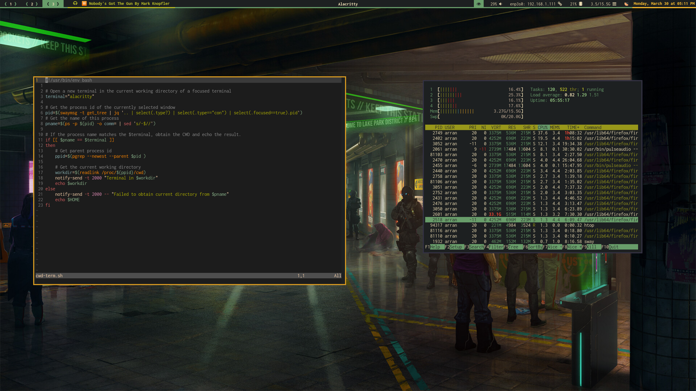

# Dotfiles
My Dotfiles, there are many like them but these are mine.



# Install

## Requires
- https://github.com/twpayne/chezmoi

## Initialize

```shell
# HTTPS
$ chezmoi init https://github.com/azza292/dotfiles

# SSH
$ chezmoi init git@github.com:Azza292/dotfiles.git
```


# Software Used

- Sway
- Alacritty
- Neovim / Vim
- Waybar
- Mako
- Bash / Fish

- i3 (For WSL)

